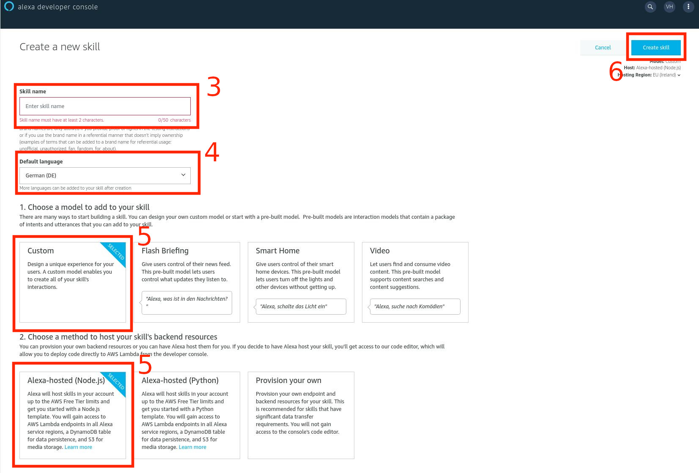
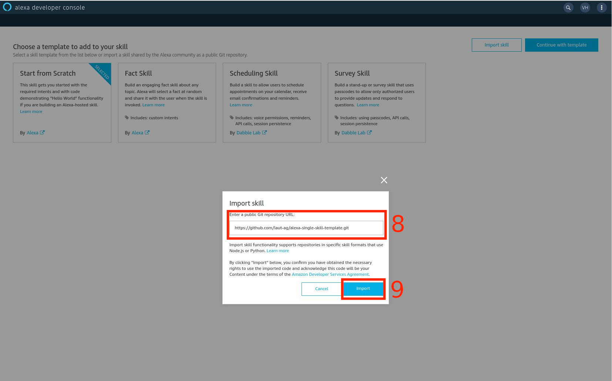
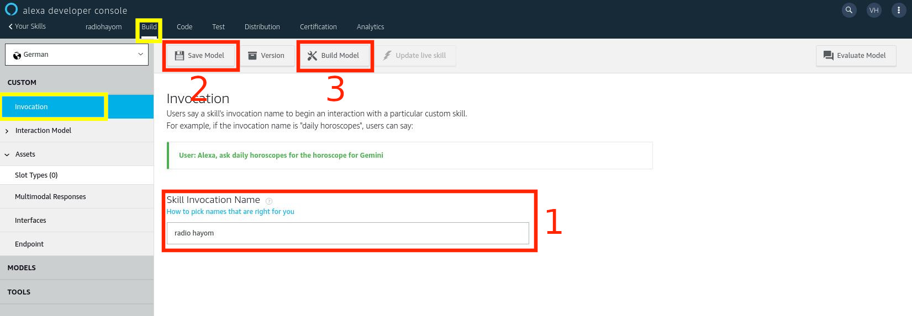
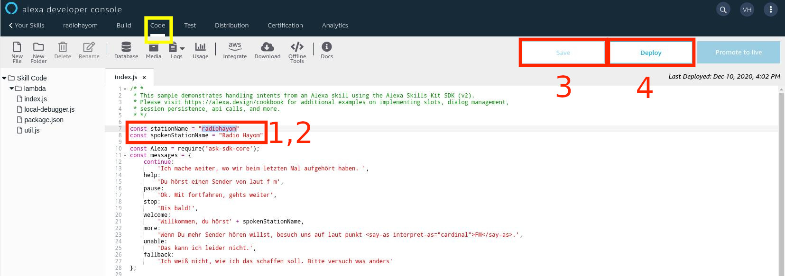

# Alexa Single-Skill Template

## Anleitung

### Create Skill

1. Besuche <https://developer.amazon.com/alexa/console/ask/> und einlogge
2. Klicke **Create New Skill**
3. Gib das **Skill name** ein
4. Wähle **Default language** -> **German(DE)** aus
5. Prüfe dass **Custom** und **Alexa-hosted (Node.js)** ausgewählt sind 
6. Klicke **Create skill**

7. Klicke **Import skill**

8. Füge <https://github.com/laut-ag/alexa-single-skill-template.git> im Textfeld ein
9. Klicke **Import**


### Build -> Invocation

1. Gib das **Skill Invocation Name** ein
2. Klicke **Save Model**
3. Klicke **Build Model**


### Code

1. Überarbeite `const stationName = "<deine Station-Name>"`
2. Überarbeite `const spokenStationName = "<deine ausgesprochene Station-Name>"`

Tausche `<deine Station-Name>` mit der Name, die man deinen Stream hören kann. d.h. `stream.laut.fm/<deine Station-Name>`

Tausche `<deine ausgesprochene Station-Name>` mit der Name, die Alexa ___sagen___ soll.

3. Klicke **Save**
4. Klicke **Deploy** 



### Distribution -> Skill Preview -> German

1. Gib das **Public Name** ein. Diese Name wird im Skill-Store angezeigt
2. Gib das **One Sentence Description** ein
3. Gib das **Detailed Description** ein
4. Gib das **Example Phrases** ein
```
Alexa, öffne <deine ausgesprochene Station-Name>
Alexa, starte <deine ausgesprochene Station-Name> 
```
5. Lade das **Small Skill Icon** (108x108px PNG oder JPG) hoch
6. Lade das **Large Skill Icon** (512x512px PNG oder JPG) hoch
7. Gib die **Keywords** ein
8. Klicke **Save and continue**

### Distribution -> Privacy & Compliance

1. Antworte diese Fragen wahr. Wenn du dies Muster benutzt, **ohne irgend was geändert zu haben**, dann darfst du die Antworten nach den unteren Bild eingeben.
2. Gib die **Testing Instructions** ein
```
Starte den Stream indem Du sagst "Öffne <your spoken station name>"
```
3. Klicke **Save and continue**


### Test

Du soll den Skill einmal testen. Du kannst den Skill testen mit ein Echo-Gerät oder Alexa App auf deinen Handy. Um den **Development** Skill zu testen, muss du mit demselben Amazon-Konto, damit du den Skill im **Developer Console** bearbeitest, auf den Gerät einloggen.  

### Certification -> Validation

1. Klicke **Run**

2. Bearbeite irgend angezeite Fehler

Wiederhole Schritte 1 und 2 bis es gibt keinen Fehler. Dannach mit diese Anleitung fortfahren.

### Certification -> Submission

1. Gib ein optionales privates **Version message** ein
2. Klicke **Submit for review**


Warte bis Amazon deinen Skill bestätigt oder ablehnt. Wenn sie der Skill ablehnen, sollen sie ein E-Mail mit dem Grund für die Ablehnung schicken. Wenn du die Fehler behoben hast, darfts du den Skill wieder submittieren.
